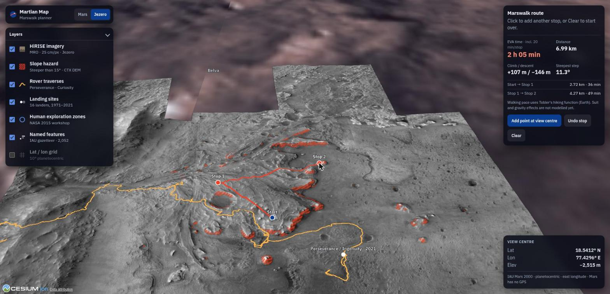

# Martian Map: Jezero Marswalk Planner

**NASA Space Apps Challenge 2026 · Team Protikriti**
Challenge: [*Interplanetary Survival Guide: Martian Map*](https://www.spaceappschallenge.org/) (Intermediate · Human Exploration, Mars, Planets & Moons, Software)

> The challenge: build a layered, integrated view of a location or route on the Martian surface that pulls together data from multiple NASA science missions, to help a human explorer plan a successful Marswalk while doing new science along the way.

A 3D map of Mars that layers data from six NASA/USGS sources and plans the **safest, timed Marswalk** between science stops at Jezero Crater, where Perseverance landed.



## What it does

- **Plan a Marswalk.** Click a start, then science stops. Each leg is the fastest route that never crosses ground steeper than 15° (A* over a 20 m CTX elevation model, walking speed from Tobler's hiking function). You get distance, climb and descent, the steepest step, and EVA time including 20 min per stop.
- **See the hazards.** Slopes over 15° are hatched in NASA red on 25 cm/px HiRISE imagery draped over real terrain (2× vertical exaggeration).
- **Explore all of Mars.** 2,052 IAU-named features, all 16 lander sites (including crashes), Perseverance and Curiosity traverses, and the 30 candidate human Exploration Zones from NASA's 2015 workshop.
- **Honest coordinates.** Mars has no GPS. Positions use the IAU Mars 2000 planetocentric frame (east longitude 0–360°). The globe uses the same Mars sphere as the data, so the numbers you read are exact.

## Run it

```bash
make install   # uv sync + npm ci
make data      # download NASA/USGS sources, build grid + layers into web/public/data
make dev       # http://localhost:5173
make test lint # pytest + vitest, ruff + mypy --strict + eslint + tsc
```

## Quality

- **81 automated tests:** 25 Python (pytest) and 56 TypeScript (Vitest), covering slope, DEM I/O, layer building, A* routing, the Web Worker protocol and the planner state.
- **Strict checks:** `ruff`, `mypy --strict`, ESLint (strict), `tsc --noEmit` and Prettier. CI runs `make lint test` on every push.
- **Measured on the production build:** Largest Contentful Paint 1.76 s, Cumulative Layout Shift 0. A 10.9 km route computes in about 0.34 s, off the main thread.

## Architecture

```
USGS CTX DEM ─┐                           ┌─ grid.bin/json ─┐
IAU gazetteer ─┼─ pipeline/ (Python) ──────┼─ slope_hazard.png├─ web/ (TypeScript + CesiumJS, static)
NASA MMGIS    ─┤  load · slope · export    └─ layers/*.geojson┘   core/  pure logic: grid, A*, summary, planner
curated JSON  ─┘                                                  map/   Cesium: viewer, terrain, layers, route
                                                                  ui/    panels · routing runs in a Web Worker
```

- `pipeline/`: `python -m marsmap build` (DEM → 562×593 elevation grid + hazard overlay) and `python -m marsmap layers` (names, traverses, landing sites, exploration zones → GeoJSON).
- `web/src/core`: framework-free, fully unit-tested logic. `map/` and `ui/` are the thin shell.
- No backend. Everything is static files, deployable to GitHub Pages (`.github/workflows/deploy.yml`).

Engineering standards: [CLAUDE.md](CLAUDE.md) · Product/design brief: [PRODUCT.md](PRODUCT.md) · Data provenance: [docs/data-sources.md](docs/data-sources.md) · Plan: [docs/superpowers/plans](docs/superpowers/plans).

## Team Protikriti

| Name | Role |
|---|---|
| _add team member_ | _role_ |

## Contributing (team workflow)

1. Branch from `main`: `git switch -c feat/<short-name>`.
2. Follow [CLAUDE.md](CLAUDE.md) (our engineering standards): write the failing test first, keep functions small, and put units in names.
3. Run `make lint test` before pushing, then open a pull request into `main`.
4. Never commit downloaded data (`data/raw/`) or secrets (`.env`).

## Limitations (known, deliberate)

- **Walking speed is an Earth model.** Tobler's function is not adjusted for spacesuits or Mars gravity. The multiplier is in `speedFactor`, ready to tune.
- **20 m DEM resolution.** Boulders and small scarps below 20 m are not in the slope model, so a real EVA needs HiRISE-DTM (1 m) checks.
- **Elevation readout covers only the Jezero grid.** Outside it the terrain is a placeholder and the readout shows "—".
- **Exploration Zones sit on their named IAU feature** (or on coordinates stated in the abstract), not on the exact proposal polygons.
- **Science-stop time is a planning assumption** (20 min), not mission data.
