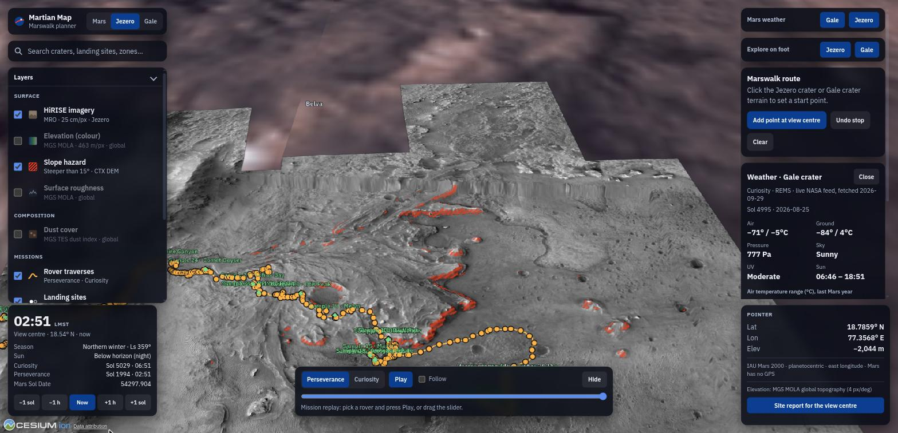
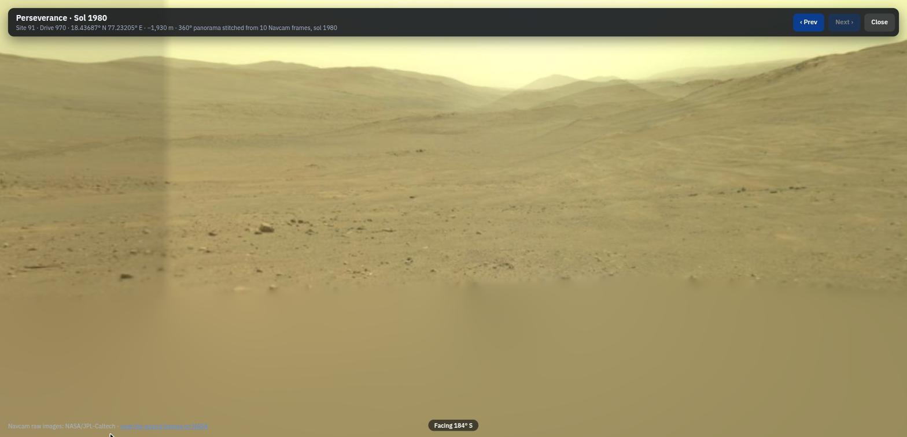
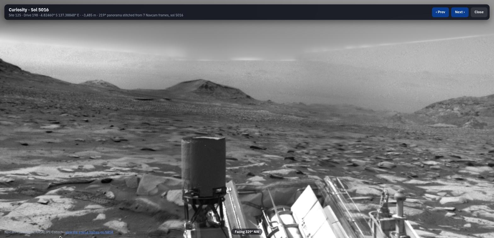

# Martian Map

**A Google-Maps-style atlas of Mars for the first human explorers.**

NASA Space Apps Challenge 2026 · **Team Protikriti** · Challenge: [*Interplanetary Survival Guide: Martian Map*](https://www.spaceappschallenge.org/) (Human Exploration · Mars · Software)


> **The challenge:** build a layered, integrated view of a location or route on the Martian surface that pulls together data from multiple NASA science missions, to help a human explorer plan a successful Marswalk while doing new science along the way.

🌐 **Live: [martian-map.vercel.app](https://martian-map.vercel.app)**

Martian Map puts a 3D globe, rover Street View, live weather, walkable terrain and a safe-route planner on one map of Mars, built entirely from open NASA, USGS and IAU data. 📄 **[Feature list (PDF)](docs/feature-list.pdf)**



<table>
<tr>
<td width="50%"></td>
<td width="50%"></td>
</tr>
<tr>
<td><sub>Street View · Perseverance, sol 1980: 10 Navcam frames stitched into 360°</sub></td>
<td><sub>Street View · Curiosity, sol 5016: 7 frames stitched into 219°</sub></td>
</tr>
</table>

## Contents

[Features](#features) · [Controls](#controls) · [Install](#install) · [For young explorers](#for-young-explorers-) · [How it works](#how-it-works) · [Data](#data) · [Project structure](#project-structure) · [Quality](#quality) · [Team](#team-protikriti) · [Limitations](#limitations)

## Features

| | Feature | What you can do |
|---|---|---|
| 🌍 | **Whole-planet 3D globe** | Spin around all of Mars on MOLA topography, with high-resolution terrain at Jezero (20 m) and Gale (32 m). Search 2,052 IAU-named places, 16 lander sites and 30 candidate human Exploration Zones. Every view has a shareable link. |
| 📷 | **Rover Street View** | Stand at any of 2,087 rover stops (703 Perseverance, 1,384 Curiosity) and look around a panorama stitched live from NASA's raw Navcam images. Walk arrows take you to the next stop. |
| 🥾 | **Safe Marswalk planner** | Click a start and science stops. Each leg is the fastest route that never crosses ground steeper than 15°, with distance, climb, steepest step and EVA time. |
| 🎮 | **Explore on foot** | Walk the real terrain at true scale with the keyboard, starting where the rover is today. |
| 🌡️ | **Live Mars weather** | Curiosity's REMS station (live) and Perseverance's MEDA (latest archive): temperatures, pressure, UV, sunrise and sunset, and a Mars-year chart. |
| ⏱️ | **Mission replay and samples** | Play both rovers' journeys sol by sol with a 3D Perseverance, and open all 30 Perseverance rock-sample cores where they were sealed. |
| 🏕️ | **Settlement site reports** | Right-click anywhere: elevation, terrain detail, daylight, season, buried-ice likelihood (SWIM), surface radiation, and the nearest named feature, landing site and Exploration Zone. |
| 🗺️ | **Science layers** | Every released HiRISE image strip on the planet (down to ~25 cm/px), 17 controlled HiRISE site mosaics you can search by name (Jezero, Gale, Spirit, Opportunity, Phoenix, Viking 1 and 2, Pathfinder, InSight, the Ares 3 and 4 sites from *The Martian*, and more), CTX imagery, MOLA colour elevation, TES dust, surface roughness, slope hazards and a lat/lon grid. |
| 🕰️ | **Mars clock and coordinates** | Local solar time, each rover's sol, season (Ls) and Mars Sol Date; the real sun lights the globe. Positions use the IAU Mars 2000 frame (Mars has no GPS). |

## Controls

| Where | Action | How |
|---|---|---|
| **Map** | Rotate / zoom / tilt | Drag · scroll · Ctrl + drag (zoom stops 20 m above the ground) |
| | Fly to HiRISE imagery | Search a site name, e.g. "Opportunity", "Viking 1" or "Ares 3" |
| | Site report | Right-click the ground, or **Site report for the view centre** |
| | Open Street View, a weather station or a sample | Click its marker (Street View cameras appear when you zoom within ~150 km) |
| **Street View** | Look around / zoom | Drag or arrow keys · scroll or `+` `-` |
| | Next stop | Click an arrow on the ground, or **Prev** / **Next** |
| | Leave | `Esc` or **Close** |
| **Explore on foot** | Walk / strafe / turn | `W` `S` or `↑` `↓` · `A` `D` · `←` `→` |
| | Look | Drag |
| | Leave | `Esc` |

## Install

Tested on Ubuntu Linux. macOS works the same way. On Windows, use WSL (the data scripts need `bash` and `make`).

### 1. Install the tools (once per computer)

| Tool | Version | Why |
|---|---|---|
| [Git](https://git-scm.com/downloads) | any | download the code |
| [Node.js](https://nodejs.org/) | 20.19+ or 22.12+ | runs the website (Vite 8) |
| [uv](https://docs.astral.sh/uv/getting-started/installation/) | any recent | runs the Python data pipeline; it installs Python 3.12 for you |
| `make` and `curl` | any | one-command setup |

- **Ubuntu / Debian / WSL:**
  ```bash
  sudo apt update && sudo apt install -y git make curl
  curl -fsSL https://deb.nodesource.com/setup_22.x | sudo -E bash - && sudo apt install -y nodejs
  curl -LsSf https://astral.sh/uv/install.sh | sh    # then open a new terminal
  ```
- **macOS** (with [Homebrew](https://brew.sh)):
  ```bash
  xcode-select --install          # git, make and curl
  brew install node uv
  ```
- **Windows:** open PowerShell as administrator, run `wsl --install`, restart, open the **Ubuntu** app and follow the Ubuntu steps above. Keep the project inside the Ubuntu home folder (not `C:\`), or it will be slow.

Check everything is there:

```bash
git --version && node --version && uv --version && make --version | head -1
```

### 2. Get the code

The repository is private, so a team owner must add you as a collaborator first. Then:

```bash
git clone https://github.com/AhsanulHoque22/Nasa-Space-Apps-Challenge-2026-Team-Protikriti.git martian-map
cd martian-map
```

Git asks you to sign in. The easiest way is the [GitHub CLI](https://cli.github.com/): `gh auth login`, then clone.

### 3. Install, download the data, run

```bash
make install   # Python and JavaScript dependencies
make data      # downloads ~170 MB of NASA/USGS data and builds the map files (several minutes)
make dev       # starts the app
```

Open **http://localhost:5173** in Chrome, Edge or Firefox (WebGL2 is required). Stop the app with `Ctrl+C`.

`make data` only needs to run once. It skips files it has already downloaded, so re-running it after an interrupted download is safe.

### Other commands

```bash
make test lint   # pytest + vitest, ruff + mypy --strict + eslint + tsc + prettier
make build       # production build in web/dist
cd web && npm run preview   # serve that build at http://localhost:4173
```

### Deploy to Vercel

```bash
make build                          # web/dist, including the map data and vercel.json
cd web/dist
npx vercel link --yes --project martian-map
npx vercel deploy --prod --yes      # publishes https://martian-map.vercel.app
```

`npx vercel login` first if the CLI isn't signed in; it prints a link you can approve from any device.

### Troubleshooting

| Problem | Fix |
|---|---|
| `uv: command not found` | Open a new terminal after installing uv, or run `source ~/.bashrc` (Linux) / `source ~/.zshrc` (macOS). |
| `npm ci` fails with an engine or syntax error | Node is too old: `node --version` must be 20.19+ or 22.12+. |
| The map says `HTTP 404 (did you run make data?)` | Run `make data` from the project folder, then refresh the page. |
| `make data` stops with a `curl` error | A NASA server was busy. Run `make data` again; it resumes where it stopped. |
| Street View says NASA's service did not answer | NASA's raw-image API is sometimes slow. Press **Try again**. |
| Street View shows separate photos instead of one smooth panorama | The page isn't served by `make dev` or `npm run preview`, so the `/nasa-raw` image proxy is missing (see Architecture). |
| A black screen or "WebGL2 is not available" | Turn on hardware acceleration in the browser settings, or try another browser. |

## For young explorers 🚀

*A guide for kids and the grown-up helping them. You need about 30 minutes and an internet connection.*

### Part 1: the grown-up sets it up

Setting up is the only tricky part, so a grown-up should do it. Follow **Install** above, steps 1 to 3. After the first time, starting the app is just two commands:

```bash
cd martian-map
make dev
```

Then open **http://localhost:5173**. Tip: bookmark it!

### Part 2: your mission, explorer

You are planning the first human walk on Mars. Everything you see is real data from NASA robots and satellites.

1. **Spin the planet.** Drag to turn Mars, scroll to zoom. Mars is red because its dust is rusty!
2. **Find a famous place.** Type **Olympus Mons** in the search box. It's the tallest volcano in the whole solar system, about 2.5 times as tall as Mount Everest.
3. **Visit a robot.** Press the **Jezero** button at the top to fly to the crater where the Perseverance rover landed in 2021. The orange line is the path it drove.
4. **See through the rover's eyes.** Zoom in close to the orange line and click a camera dot. You are now standing where Perseverance stood! Drag to look around, click the arrows on the ground to drive to the next stop, and press `Esc` to leave.
5. **Check the weather.** Press **Gale** under *Mars weather*. Is it colder than your freezer? (Hint: almost always!)
6. **Go for a walk.** Press **Jezero** under *Explore on foot*. Walk with `W` `A` `S` `D` or the arrow keys and look around by dragging. Press `Esc` to stop.
7. **Plan a safe Marswalk.** In the *Marswalk route* panel, press **Add point at view centre**, move the map, and add a few more stops. The app finds a path that avoids the red hatched areas, which are too steep to walk on safely.
8. **Travel in time.** At the bottom, press **Play** in *Mission replay* and watch the rover's whole journey, sol by sol. (A *sol* is one Mars day: 24 hours and 40 minutes.)

**Challenge:** find a Perseverance rock sample (try searching **Sample**) and visit it in Street View. Can you see the rock the rover drilled?

**Stay safe online:** only open links a grown-up says are OK, and ask before downloading anything.

## How it works

- **Routing.** A* over the site's elevation grid, costed by walking time from Tobler's hiking function. Any cell steeper than 15° is impassable, so routes go around hazards rather than along their edges. It runs in a Web Worker; a 10 km route takes about 0.3 s.
- **Street View.** From all Navcam frames at a stop, the viewer keeps the imaging sequence with the widest sweep and drops repeated shots. A worker then stitches them into one equirectangular sphere (`web/src/core/stitch.ts`):
  1. pinhole projection through the mast's pointing (sensor tiles are windows of one camera), turned to compass bearings with the rover's heading;
  2. lens-vignetting correction and Brown & Lowe gain compensation between frames;
  3. feathered blending across seams;
  4. push-pull pyramid filling for sky and ground no frame saw.

  WebGL2 draws the result.
- **Mars time.** The NASA GISS Mars24 algorithm gives the Mars Sol Date, local solar time, solar longitude (season) and the sun's position. Rover sols are checked against NASA's own raw-image sol numbers.
- **Coordinates.** Everything uses the Mars 2000 sphere (radius 3,396,190 m), planetocentric latitude and east longitude, the same frame as the source data, so readouts are exact.

## Data

Every dataset is open and cited in full, with product IDs and URLs, in **[docs/data-sources.md](docs/data-sources.md)**.

| Dataset | Mission / instrument |
|---|---|
| Global topography | Mars Global Surveyor · MOLA MEGDR |
| Jezero and Gale terrain | MRO CTX DEM, 20 m · HiRISE-derived MSL DEM mosaic (USGS) |
| Imagery | MRO HiRISE (25 cm) · CTX · Viking MDIM, via NASA Trek |
| Rover tracks and stops | JPL MMGIS traverses and waypoints |
| Street View photos | Perseverance and Curiosity Navcam raw images |
| Weather | Curiosity REMS · Perseverance MEDA |
| Buried ice | SWIM 2.0 |
| Radiation | Curiosity RAD (Hassler et al. 2014) |
| Dust | MGS TES dust index |
| Place names | IAU / USGS Gazetteer of Planetary Nomenclature |
| Exploration Zones | NASA 2015 First Landing Sites workshop |
| Samples and rover model | NASA Mars Rock Samples · NASA 3D Resources |

## Project structure

```
NASA MOLA · USGS DEMs ─┐                              ┌─ sites/*/grid.bin + slope_hazard.png ─┐
IAU gazetteer          ─┤                              ├─ mola.bin · swim.bin                  │
JPL MMGIS              ─┼─ pipeline/  (Python 3.12) ───┼─ layers/*.geojson · stops/*.json      ├─ web/  (TypeScript + CesiumJS, static site)
SWIM · REMS/MEDA       ─┤   python -m marsmap …        ├─ activities.json                      │    live: NASA weather + raw-image APIs
curated JSON           ─┘                              └─ weather/ snapshots                   ┘
```

| Path | What lives there |
|---|---|
| `pipeline/src/marsmap/` | Data pipeline CLI: `sites`, `mola`, `swim`, `layers`, `stops`, `activities`, `weather`. `make data` runs them all. |
| `pipeline/data/` | Curated inputs: site list, landing sites, Exploration Zones, rock samples |
| `web/src/core/` | Pure, unit-tested logic: routing, Mars time, weather, search, Street View selection and stitching |
| `web/src/map/` | CesiumJS globe, layers, terrain, workers, WebGL panorama renderer |
| `web/src/ui/` | Panels and dialogs: search, layers, route, weather, clock, Street View, explore, site report |
| `docs/` | Data sources, feature list PDF, demo script, design spec and plans |

There is no backend: the app is static files plus live calls to NASA's open APIs. Street View stitching reads NASA image pixels through a same-origin `/nasa-raw` → `https://mars.nasa.gov` proxy (built into `npm run dev` and `npm run preview`). The live site runs on Vercel, where `web/public/vercel.json` provides the same rewrite. A static host without it falls back to unstitched photos.

## Quality

- **182 automated tests:** 40 Python (pytest) and 142 TypeScript (Vitest), covering slope, DEM I/O, layer building, A* routing, Mars time, weather parsing, panorama selection and stitching, and the planner state.
- **Strict checks:** `ruff`, `mypy --strict`, ESLint (strict), `tsc --noEmit` and Prettier. CI runs `make lint test` on every push.
- **Responsive by design:** routing and Street View stitching run in Web Workers; NASA API calls retry with backoff.
- **Accessible:** keyboard-operable, labelled controls; hazards are hatched, never shown by colour alone.

Engineering standards: [CLAUDE.md](CLAUDE.md) · Product and design brief: [PRODUCT.md](PRODUCT.md) · Plans and specs: [docs/superpowers](docs/superpowers)

## Team Protikriti

| Name | Role |
|---|---|
| _add team member_ | _role_ |

## Contributing (team workflow)

- **Repo owner:** commits directly to `main`.
- **Teammates:** create your own branch from the latest `main` (`git switch main && git pull && git switch -c <your-name>/<short-topic>`), push it, and open a pull request into `main`.
- **Everyone:**
  - Follow [CLAUDE.md](CLAUDE.md), our engineering standards: write the failing test first, keep functions small, and put units in names.
  - Run `make lint test` before pushing.
  - Never commit downloaded data (`data/raw/`) or secrets (`.env`).

## Limitations

Known and deliberate:

- **Walking speed is an Earth model.** Tobler's function is not adjusted for spacesuits or Mars gravity; the `speedFactor` multiplier is ready to tune.
- **Slope maps resolve 20–32 m.** Boulders and small scarps are not in the model, so a real EVA needs 1 m HiRISE DTM checks.
- **Routes only inside the two high-resolution sites.** Elsewhere the terrain is global MOLA (about 15 km per pixel).
- **Perseverance weather is archival.** MEDA's public feed stopped updating in April 2024; Curiosity's REMS is live.
- **Street View exposure is approximate.** Lens vignetting is corrected with one fitted exponent, not the per-camera flat field, so faint brightness steps can remain at some seams.
- **Exploration Zones sit on their named IAU feature** (or the abstract's coordinates), not on the exact proposal polygons.
- **Science-stop time is a planning assumption** (20 min per stop), not mission data.

## Credits

Imagery and data © NASA/JPL-Caltech, USGS Astrogeology, MSSS, University of Arizona (HiRISE) and the IAU. Built with [CesiumJS](https://cesium.com/platform/cesiumjs/), [Vite](https://vite.dev/), [rasterio](https://rasterio.readthedocs.io/) and [uv](https://docs.astral.sh/uv/).
